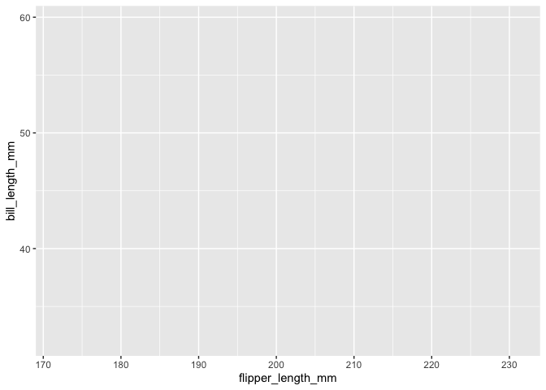
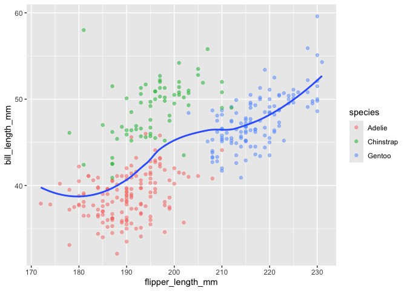
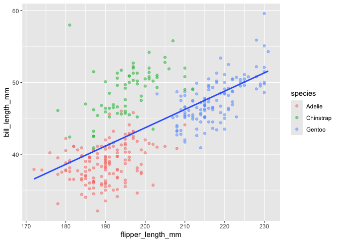
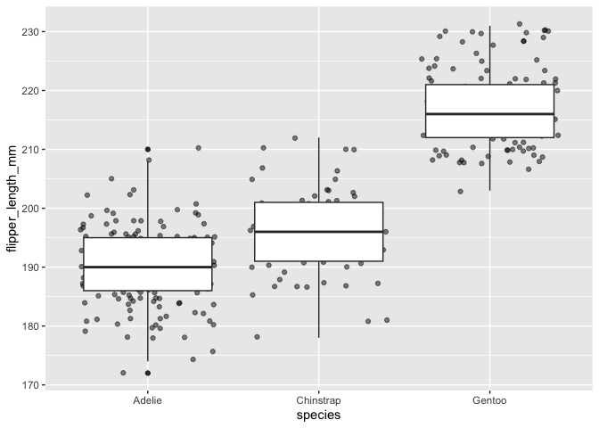
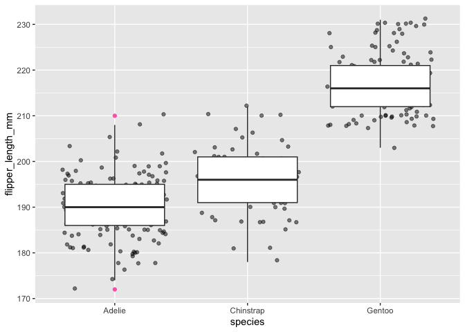
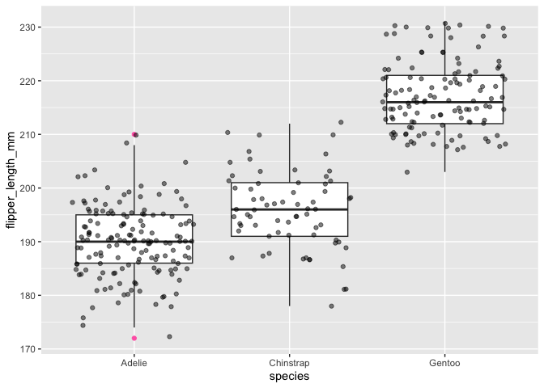
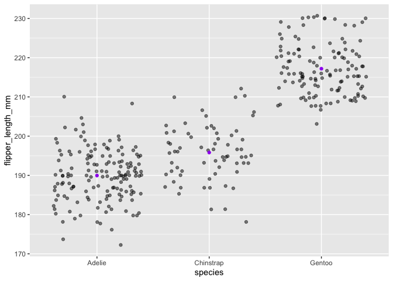
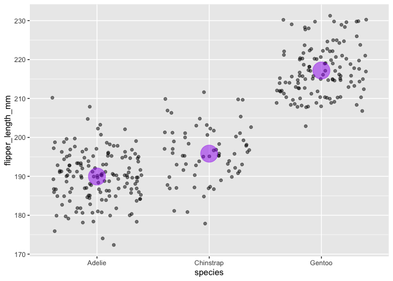
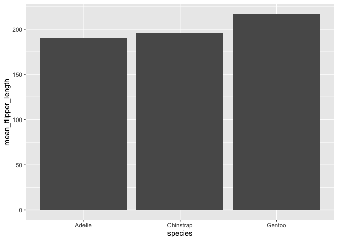
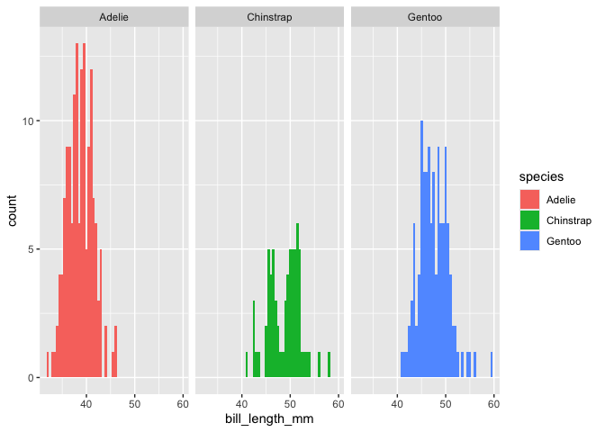

# Lab 04: `ggplot2`


## Penguins

It’s time to explore a new dataset! We’re going to use the [Palmer
Penguins](https://github.com/allisonhorst/palmerpenguins) dataset in
this lab.


This data comes from the `palmerpenugins` package, which you can install
from CRAN.

``` r
#install.packages("palmerpenguins")
```

To load the package, type `library(penguins)`, which will give you
access to the built-in dataset, called penguins

``` r
library(tidyverse)
library(palmerpenguins)
```

The `palmerpenguins` data contains data for three penguin species
observed on three islands in the Palmer Archipelago, Antarctica over a
study period of three years.


Take a quick look at the penguins data.

``` r
str(penguins)
```

    tibble [344 × 8] (S3: tbl_df/tbl/data.frame)
     $ species          : Factor w/ 3 levels "Adelie","Chinstrap",..: 1 1 1 1 1 1 1 1 1 1 ...
     $ island           : Factor w/ 3 levels "Biscoe","Dream",..: 3 3 3 3 3 3 3 3 3 3 ...
     $ bill_length_mm   : num [1:344] 39.1 39.5 40.3 NA 36.7 39.3 38.9 39.2 34.1 42 ...
     $ bill_depth_mm    : num [1:344] 18.7 17.4 18 NA 19.3 20.6 17.8 19.6 18.1 20.2 ...
     $ flipper_length_mm: int [1:344] 181 186 195 NA 193 190 181 195 193 190 ...
     $ body_mass_g      : int [1:344] 3750 3800 3250 NA 3450 3650 3625 4675 3475 4250 ...
     $ sex              : Factor w/ 2 levels "female","male": 2 1 1 NA 1 2 1 2 NA NA ...
     $ year             : int [1:344] 2007 2007 2007 2007 2007 2007 2007 2007 2007 2007 ...

To learn about the dataset, read the documentation
[here](https://allisonhorst.github.io/palmerpenguins/index.html#about-the-data)
and
[here](https://allisonhorst.github.io/palmerpenguins/reference/penguins.html).

### The philosophy of `ggplot2`

Before we get started, lets quickly remind ourselves about the
philosophy of `ggplot2()`

#### What is a plot?

According to the grammar of graphics, we can think of a statistical plot
as being made up of:

- Data (*We need something to plot, right?!*)
- Mappings from data to aesthetic attributes (colour, shape, size)
- Geometric objects (points, lines, bars)

#### How do I make a plot in `ggplot2`?

To make a plot in `ggolot2`, you need some data (maybe some data about
penguins!), you set mappings using the `aes()` function, and you add
geometric objects using the `geom_` functions.

Let’s build our first plot!

## Scatterplots

### Your first plot

We’ll start by slowly building a scatter plot.

First add data..

``` r
ggplot(data = penguins)
```


Not exactly awe-inspiring.

To make our plot a little more interesting, we need to add a mapping
system. The mapping system lets you map data to visual elements of your
plot. Typically, this involves mapping variables in your data to
coordinate systems like the x- and y-axis.

We are going to plot the relationship between flipper length and bill
length. To do that, we use the `aes()` function.

``` r
ggplot(penguins, aes(x = flipper_length_mm, y = bill_length_mm))
```



The final element we need to add is a geometric object. Geometric
objects describe to `ggplot2` what visual are you going to use to
represent the observations in your data. Here we are saying that each
observation should be represented by a point. We’ll use the
[`geom_point()`](https://ggplot2.tidyverse.org/reference/geom_point.html)
function to add points to our plot.

``` r
ggplot(data = penguins, aes(x = flipper_length_mm, y = bill_length_mm)) + 
    geom_point()
```


### Adding more elements

Let’s add some colour to our plot. We are going to map the colour of the
points to the species variable in `penguin` data set. We do that in the
`aes()` function.

``` r
penguins |> 
    ggplot(aes(x = flipper_length_mm, y = bill_length_mm)) + 
    geom_point(aes(color = species)) 
```


I have a suspicion that there might be some overplotting happening.
Overplotting is when the data points overlap, making it difficult to see
individual data points in a plot.

To see if we have overplotting, adjust the `alpha` of the points on our
plot. `alpha` refers to the opacity of a geom - Values of alpha range
from 0 to 1, with lower values corresponding to more transparent
colours.

I’m going to try and set `alpha` to .5.

``` r
penguins |> 
    ggplot(aes(x = flipper_length_mm, y = bill_length_mm)) + 
    geom_point(aes(color = species), alpha = .5) 
```


You can see from the slight differences in the shades of the points that
there is a little overplotting happening, but it doesn’t look like it’s
a huge cause for concern.

#### Adding a fit line

Another thing we often want to do is to add a line over our scatterplot
to describe a relationship between variables. We can do this by adding a
[`geom_smooth()`](https://ggplot2.tidyverse.org/reference/geom_smooth.html)
layer to our plot.

Note that “loess” (locally weighted smoothing) is the default fit method
for `geom_smooth()`.

Learn more about loess smoothing
[here](https://www.statisticshowto.com/lowess-smoothing/).

``` r
penguins |> 
    ggplot(aes(x = flipper_length_mm, y = bill_length_mm)) + 
    geom_point(aes(color = species), alpha = .5) + 
    geom_smooth()
```


The shaded area around the fit line represents the standard error. We
can get rid of that by setting the `se` argument to `FALSE`.

``` r
penguins |> 
    ggplot(aes(x = flipper_length_mm, y = bill_length_mm)) + 
    geom_point(aes(color = species), alpha = .5) + 
    geom_smooth(se = FALSE)
```



As far as I know, loess smoothing isn’t a super common method in
psychology. Let’s fit a trusty regression line instead. We do that by
setting `method = "lm"` in the `geom_smooth()` function.

``` r
penguins |> 
    ggplot(aes(x = flipper_length_mm, y = bill_length_mm)) + 
    geom_point(aes(color = species), alpha = .5) + 
    geom_smooth(method = "lm", se = FALSE)
```



It might be helpful to fit regression lines for each species of
penguins. It’s simple to do; all you need is a small change to the
`aes()`function.

``` r
penguins |> 
    ggplot(aes(x = flipper_length_mm, y = bill_length_mm)) + 
    geom_point(aes(color = species), alpha = .5) + 
    geom_smooth(aes(color = species), method = "lm", se = FALSE)
```


To further differentiate data points from different species, you could
also try changing the types of points that are being plotted. I’m going
to give a different type of point to each species of penguins. To do
that, I need to edit the `aes()` within `geom_point()`.

``` r
penguins |> 
    ggplot(aes(x = flipper_length_mm, y = bill_length_mm)) + 
    geom_point(aes(color = species, shape = species), alpha = .5) + 
    geom_smooth(aes(color = species), method = "lm", se = FALSE)
```


Our plot is looking pretty great! Let’s add a theme.

``` r
penguins |> 
    ggplot(aes(x = flipper_length_mm, y = bill_length_mm)) + 
    geom_point(aes(color = species, shape = species), alpha = .5) + 
    geom_smooth(aes(color = species), method = "lm", se = FALSE) +
    theme_minimal()
```


Finally, we can make some of the labels a bit more descriptive with the
`labs()` function.

``` r
penguins |> 
    ggplot(aes(x = flipper_length_mm, y = bill_length_mm)) + 
    geom_point(aes(color = species, shape = species), alpha = .5) + 
    geom_smooth(aes(color = species), method = "lm", se = FALSE) +
    theme_minimal() + 
    labs(x = "Flipper length (mm)", y = "Bill length (mm)", 
             title = "Penguin bills and flippers", 
             subtitle = "The relationship between bill and flipper length in three penguin species:\nGentoo, Chinstrap, and Adélie", color = "Species", shape = "Species")
```


Note that there is some redundancy in the code I wrote to produce this
plot. `color = species` is repeated twice. To avoid this repetition you
could move it into the first `ggplot()` function.

``` r
penguins |> 
    ggplot(aes(x = flipper_length_mm, y = bill_length_mm, color = species)) + 
    geom_point(aes(shape = species), alpha = .5) + 
    geom_smooth(method = "lm", se = FALSE) +
    theme_minimal() + 
    labs(x = "Flipper length (mm)", y = "Bill length (mm)", 
             title = "Penguin bills and flippers", 
             subtitle = "The relationship between bill and flipper length in three penguin species:\nGentoo, Chinstrap, and Adélie", color = "Species", shape = "Species")
```

## Strip plots

You can now see how we build a plot slowly through the addition of
layers. Let’s make a slightly different but related plot type: strip
plot. A strip plot is a scatter plot but with a categorical variable on
one of the axes.

Let’s make a strip plot with flipper length on the y-axis and species on
the x-axis.

``` r
penguins |> 
    ggplot(aes(x = species, y = flipper_length_mm)) + 
    geom_point()
```


🤔, looks like we might have a problem with overplotting.

[`geom_jitter()`]() adds a small amount of random variation to the
location of each point and is a useful way of handling overplotting.

``` r
penguins |> 
    ggplot(aes(x = species, y = flipper_length_mm)) + 
    geom_jitter()
```


Let’s also adjust the `alpha` on our points to help us see additional
overplotting. Note the position of `alpha`. It’s not wrapped in an
`aes()` function. Why is this? What happens if you put it in an `aes()`?

``` r
penguins |> 
    ggplot(aes(x = species, y = flipper_length_mm)) + 
    geom_jitter(alpha = .5)
```


Adding a boxplot might be a nice addition to our plot. To do that, you
simply add another geometric object to your plot. To add a boxplot, we
use the `geom_boxplot()` function.

``` r
penguins |> 
    ggplot(aes(x = species, y = flipper_length_mm)) + 
    geom_jitter(alpha = .5) + 
    geom_boxplot()
```



The `geom_boxplot()` function has a handy way of showing you outliers.

``` r
penguins |> 
    ggplot(aes(x = species, y = flipper_length_mm)) + 
    geom_jitter(alpha = .5) + 
    geom_boxplot(outlier.colour = "hotpink")
```



Note the importance of the order in which you add layers. Flip the order
of `geom_jitter()` and `geom_boxplot()`.

``` r
penguins |> 
    ggplot(aes(x = species, y = flipper_length_mm)) + 
    geom_boxplot(outlier.colour = "hotpink") + 
    geom_jitter(alpha = .5)
```



Let’s get rid of the boxplot and add a point representing each species’
mean flipper length. To do that, we first need to make a new data frame
with the mean flipper length for each species. We can use our new found
`dplyr` skills.

``` r
mean_flipper_by_species <- 
penguins |> 
    group_by(species) |> 
    summarise(mean_flipper_length = mean(flipper_length_mm, na.rm = TRUE))

mean_flipper_by_species
```

    # A tibble: 3 × 2
      species   mean_flipper_length
      <fct>                   <dbl>
    1 Adelie                   190.
    2 Chinstrap                196.
    3 Gentoo                   217.

We then want to add this data to our plot. We can add a new `geom_` that
has its data argument set to `mean_flipper_by_species`. Note how we map
the x and y axes to variables in the data frame
`mean_flipper_by_species`. We’ll make the new points purple so we can
see them.

``` r
penguins |> 
    ggplot(aes(x = species, y = flipper_length_mm)) + 
    geom_jitter(alpha = .5) + 
    geom_point(data = mean_flipper_by_species, 
                         aes(x = species, y = mean_flipper_length), 
                         color = "purple")
```



I want to make those purple points a little bigger. I do that using the
[`size`](https://ggplot2.tidyverse.org/articles/ggplot2-specs.html#size)
argument. I’ll also adjust the `alpha`

``` r
penguins |> 
    ggplot(aes(x = species, y = flipper_length_mm)) + 
    geom_jitter(alpha = .5) + 
    geom_point(data = mean_flipper_by_species, 
                         aes(x = species, y = mean_flipper_length), 
                         color = "purple", size = 10, alpha = .5)
```



You can hopefully see the power of layering in `ggplot2`. We can slowly
build complex plots, even combining data from multiple data frames into
a single plot.

## Bar charts

Bar charts are pretty common in psychology. Let’s make one.

We’ll use the `mean_flipper_by_species` data frame that we created in
the previous example to make our first bar chart.

The geometric object you need for a bar chart is called
[`geom_col()`](https://ggplot2.tidyverse.org/reference/geom_bar.html).

``` r
mean_flipper_by_species |> 
    ggplot(aes(x = species, y = mean_flipper_length)) +
    geom_col()
```



Our plot is a little on the grey side. We can add colour using the
`fill` aesthetic. Note that I’m mapping the species variable to the fill
argument. This means that each species will get its own color.

``` r
mean_flipper_by_species |> 
    ggplot(aes(x = species, y = mean_flipper_length)) +
    geom_col(aes(fill = species))
```


If we wanted, we could fix the colour to a set value.

``` r
mean_flipper_by_species |> 
    ggplot(aes(x = species, y = mean_flipper_length)) +
    geom_col(fill = "yellowgreen")
```


Note the different position of the fill argument. It is not wrapped
within `aes()`. Do you understand why?

I set the colour to `yellowgreen`. For a list of available colours in R,
type `colors()`.

## Exploring distributions

You’ll often want to get a sense of a variable’s distribution before
trying to fit a model to your data.

`ggplot` offers several `geoms_` that make it easy to explore the
distribution of a variable. We are going to explore
[`geom_histogram()`](https://ggplot2.tidyverse.org/reference/geom_histogram.html).

A histogram lets you explore the distribution of a single continuous
variable by dividing the x-axis into bins and counting the number of
observations in each bin.

Unlike in previous plots, we are now exploring a single variable. This
means that we are only mapping one variable onto our plot. We will
explore the variable `bill_length_mm`. To make a histogram of the
`bill_length_mm` variable, we need to map it to the x-axis using the
`aes()` function.

``` r
penguins |> 
    ggplot(aes(x = bill_length_mm)) + 
    geom_histogram()
```


`geom_historgram` picks a default binwidth when making your plot. You
should experiment with binning to find a revealing view. You can change
the `binwidth`, specify the number of `bins`, or specify the exact
location of the `breaks.` You should tweak the binning parameters to get
a revealing view of the distribution.

Here I adjust the binning parameters with the `binwidth` argument.

``` r
penguins |> 
    ggplot(aes(x = bill_length_mm)) + 
    geom_histogram(binwidth = .5)
```


We know that this distribution is made up of data from three different
species of penguins. We can colour the distribution by species to get a
better sense of this variable.

``` r
penguins |> 
    ggplot(aes(x = bill_length_mm)) + 
    geom_histogram(aes(fill = species), binwidth = .5)
```


The overlap in these distributions makes it a bit difficult to read. We
could facet our plot to see if that helps. To add a facet, we use the
`facet_wrap()` function.

``` r
penguins |> 
    ggplot(aes(x = bill_length_mm)) + 
    geom_histogram(aes(fill = species), binwidth = .5) + 
    facet_wrap(~species)
```



The horizontal arrangement of these facets isn’t super helpful for
comparing the distributions. We can arrange the facets vertically using
the `ncol` argument.

``` r
penguins |> 
    ggplot(aes(x = bill_length_mm)) + 
    geom_histogram(aes(fill = species), binwidth = .5) + 
    facet_wrap(~species, ncol = 1)
```


This plot lets us easily compare the distributions of bill length. There
are two other `geom_` functions that can be useful for looking at
distributions:
[`geom_freqpoly()`](https://ggplot2.tidyverse.org/reference/geom_histogram.html)
and
[`geom_density()`](https://ggplot2.tidyverse.org/reference/geom_density.html).

If you decide to use a distribution function where the y-axis is density
(e.g.,`geom_density()`), make sure you understand what your y-axis
represents. You can read more about this
[here](https://ggplot2-book.org/statistical-summaries.html#distributions).
I tend to stick with the trusty `geom_histogram` because it’s easy to
see how my y-axis maps onto the underlying data.

## I want to do more!

### Colour

Colour palettes can make your plots pop. We’ve been using the default
colour palettes from `ggplot`. However, you can install R packages that
give you access to new and exciting colour palettes

For example, maybe you want your plots to use colours from [Studio
Ghibli](https://en.wikipedia.org/wiki/Studio_Ghibli) movies.

You can do that with the [ghibli
package](https://github.com/ewenme/ghibli).


Or perhaps you are more of a [Wes
Anderson](https://en.wikipedia.org/wiki/Wes_Anderson) fan.


If so, take a look at the
[wesanderson](https://github.com/karthik/wesanderson) package.

### Extensions

There are a number of packages that have been written to extend the
functionality of `ggplot`. Take a look at the
[ggextensions](https://exts.ggplot2.tidyverse.org/gallery/) page to see
if any of them would be helpful for you.
