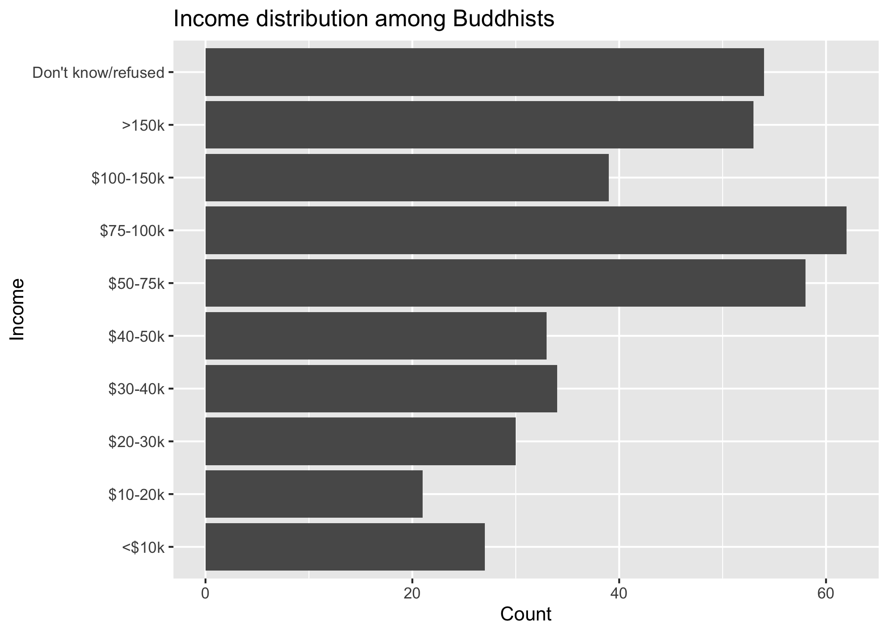
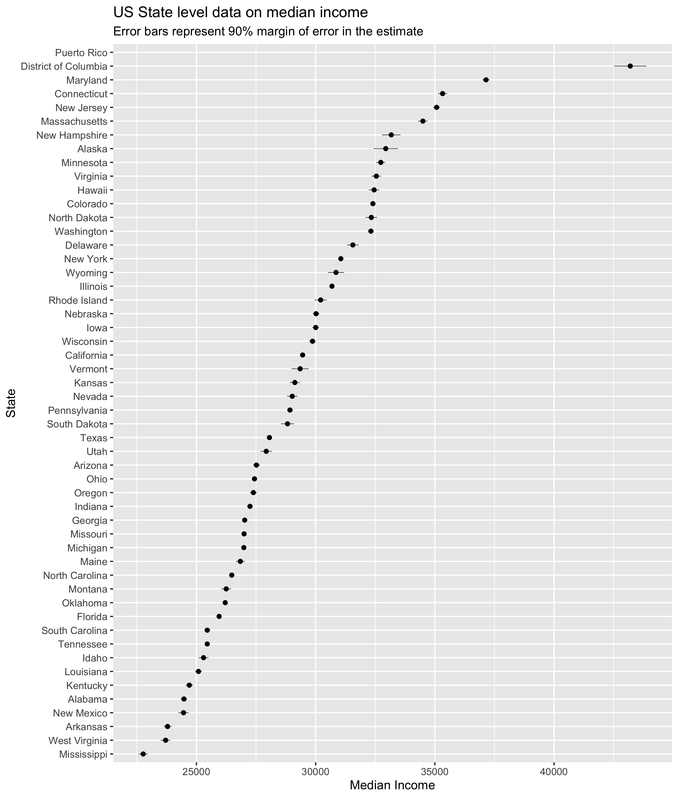

# Lab 05


## `tidyr`’s pivot functions

### `relig_income` data

The `relig_income` dataset stores counts based on a survey that asked
people about their religion and annual income. You have access to the
dataset via the `tidyr` package. If you load the `tidyverse` and type
`relig_income`, you will see the data. To learn more about the dataset
type `?relig_income`.

``` r
library(tidyverse)

relig_income |>  
  head(10)
```

    # A tibble: 10 × 11
       religion `<$10k` `$10-20k` `$20-30k` `$30-40k` `$40-50k` `$50-75k` `$75-100k`
       <chr>      <dbl>     <dbl>     <dbl>     <dbl>     <dbl>     <dbl>      <dbl>
     1 Agnostic      27        34        60        81        76       137        122
     2 Atheist       12        27        37        52        35        70         73
     3 Buddhist      27        21        30        34        33        58         62
     4 Catholic     418       617       732       670       638      1116        949
     5 Don’t k…      15        14        15        11        10        35         21
     6 Evangel…     575       869      1064       982       881      1486        949
     7 Hindu          1         9         7         9        11        34         47
     8 Histori…     228       244       236       238       197       223        131
     9 Jehovah…      20        27        24        24        21        30         15
    10 Jewish        19        19        25        25        30        95         69
    # ℹ 3 more variables: `$100-150k` <dbl>, `>150k` <dbl>,
    #   `Don't know/refused` <dbl>

We will use the `relig_income` dataset to practice `tidyr`’s `pivot`
functions.

**Pick a religion and use a `pivot` function to help you generate a plot
that visualizes the counts for the each income bracket.**

I picked Buddhists and made this plot. Can you make a similar plot?



**Next, find out which religion has the highest count in the top income
bracket.**

### `us_rent_income` dateset

The `us_rent_income` dataset is included as part of the `tidyr` package.
It contains information about median income and rent for each state in
the US for 2017.

To see the data type `us_rent_income`. To learn more about the package,
type `?us_rent_income`

**Using a `pivot` to help you along the way, find out which state has
the largest difference between income and rent?**

**Stretch goal: create a plot visualizing the income data, including the
90% margin of error in the plot. Here’s one I made earlier. Can you make
something similar?**



## Relational data

### The data

To demonstrate the different joins we will work with two small data
frames: `superheroes` and `publishers.` Copy the code below into your
RStudio code window and run it to get the `superheroes` and `publishers`
data frames.

``` r
library(tidyverse)

superheroes <- tibble::tribble(
       ~name, ~alignment,  ~gender,          ~publisher,
   "Magneto",      "bad",   "male",            "Marvel",
     "Storm",     "good", "female",            "Marvel",
  "Mystique",      "bad", "female",            "Marvel",
    "Batman",     "good",   "male",                "DC",
     "Joker",      "bad",   "male",                "DC",
  "Catwoman",      "bad", "female",                "DC",
   "Hellboy",     "good",   "male", "Dark Horse Comics"
  )

publishers <- tibble::tribble(
  ~publisher, ~yr_founded,
        "DC",       1934L,
    "Marvel",       1939L,
     "Image",       1992L
  )
```

Run through all of the code below. Try and anticipate what the join will
do.

### Mutating joins

#### left_join(superheroes, publishers)

> left_join(x, y): Return all rows from x, and all columns from x and y.
> If there are multiple matches between x and y, all combination of the
> matches are returned. This is a mutating join.

``` r
left_join(superheroes, publishers)
```

    # A tibble: 7 × 5
      name     alignment gender publisher         yr_founded
      <chr>    <chr>     <chr>  <chr>                  <int>
    1 Magneto  bad       male   Marvel                  1939
    2 Storm    good      female Marvel                  1939
    3 Mystique bad       female Marvel                  1939
    4 Batman   good      male   DC                      1934
    5 Joker    bad       male   DC                      1934
    6 Catwoman bad       female DC                      1934
    7 Hellboy  good      male   Dark Horse Comics         NA

We basically get `x = superheroes` back, but with the addition of
variable `yr_founded`, which is unique to `y = publishers`. Hellboy,
whose publisher does not appear in `y = publishers`, has an `NA` for
`yr_founded`.

#### inner_join(superheroes, publishers)

> inner_join(x, y): Return all rows from x where there are matching
> values in y, and all columns from x and y. If there are multiple
> matches between x and y, all combination of the matches are returned.
> This is a mutating join.

``` r
inner_join(superheroes, publishers)
```

    # A tibble: 6 × 5
      name     alignment gender publisher yr_founded
      <chr>    <chr>     <chr>  <chr>          <int>
    1 Magneto  bad       male   Marvel          1939
    2 Storm    good      female Marvel          1939
    3 Mystique bad       female Marvel          1939
    4 Batman   good      male   DC              1934
    5 Joker    bad       male   DC              1934
    6 Catwoman bad       female DC              1934

We lose Hellboy in the join because, although he appears in
`x = superheroes`, his publisher Dark Horse Comics does not appear in
`y = publishers`. The join result has all variables from
`x = superheroes` plus `yr_founded`, from `y`.

#### left_join(publishers, superheroes)

> left_join(x, y): Return all rows from x, and all columns from x and y.
> If there are multiple matches between x and y, all combination of the
> matches are returned. This is a mutating join.

``` r
left_join(publishers, superheroes)
```

    # A tibble: 7 × 5
      publisher yr_founded name     alignment gender
      <chr>          <int> <chr>    <chr>     <chr> 
    1 DC              1934 Batman   good      male  
    2 DC              1934 Joker    bad       male  
    3 DC              1934 Catwoman bad       female
    4 Marvel          1939 Magneto  bad       male  
    5 Marvel          1939 Storm    good      female
    6 Marvel          1939 Mystique bad       female
    7 Image           1992 <NA>     <NA>      <NA>  

We get a similar result as with `inner_join()` but the publisher Image
survives in the join, even though no superheroes from Image appear in
`y = superheroes`. As a result, Image has `NA`s for `name`, `alignment`,
and `gender`.

#### inner_join(publishers, superheroes)

> inner_join(x, y): Return all rows from x where there are matching
> values in y, and all columns from x and y. If there are multiple
> matches between x and y, all combination of the matches are returned.
> This is a mutating join.

``` r
inner_join(publishers, superheroes)
```

    # A tibble: 6 × 5
      publisher yr_founded name     alignment gender
      <chr>          <int> <chr>    <chr>     <chr> 
    1 DC              1934 Batman   good      male  
    2 DC              1934 Joker    bad       male  
    3 DC              1934 Catwoman bad       female
    4 Marvel          1939 Magneto  bad       male  
    5 Marvel          1939 Storm    good      female
    6 Marvel          1939 Mystique bad       female

Every publisher that has a match in `y = superheroes` appears multiple
times in the result, once for each match. In fact, we’re getting the
same result as with `inner_join(superheroes, publishers)`, up to
variable order (which you should also never rely on in an analysis).

#### full_join(superheroes, publishers)

> full_join(x, y): Return all rows and all columns from both x and y.
> Where there are not matching values, returns NA for the one missing.
> This is a mutating join.

``` r
full_join(superheroes, publishers)
```

    # A tibble: 8 × 5
      name     alignment gender publisher         yr_founded
      <chr>    <chr>     <chr>  <chr>                  <int>
    1 Magneto  bad       male   Marvel                  1939
    2 Storm    good      female Marvel                  1939
    3 Mystique bad       female Marvel                  1939
    4 Batman   good      male   DC                      1934
    5 Joker    bad       male   DC                      1934
    6 Catwoman bad       female DC                      1934
    7 Hellboy  good      male   Dark Horse Comics         NA
    8 <NA>     <NA>      <NA>   Image                   1992

We get all rows of `x = superheroes` plus a new row from
`y = publishers`, containing the publisher Image. We get all variables
from `x = superheroes` AND all variables from `y = publishers`. Any row
that derives solely from one table or the other carries `NA`s in the
variables found only in the other table.

### Filtering joins

#### semi_join(superheroes, publishers)

> semi_join(x, y): Return all rows from x where there are matching
> values in y, keeping just columns from x. A semi join differs from an
> inner join because an inner join will return one row of x for each
> matching row of y, where a semi join will never duplicate rows of x.
> This is a filtering join.

``` r
semi_join(superheroes, publishers)
```

    # A tibble: 6 × 4
      name     alignment gender publisher
      <chr>    <chr>     <chr>  <chr>    
    1 Magneto  bad       male   Marvel   
    2 Storm    good      female Marvel   
    3 Mystique bad       female Marvel   
    4 Batman   good      male   DC       
    5 Joker    bad       male   DC       
    6 Catwoman bad       female DC       

We get a similar result as with `inner_join()` but the join result
contains only the variables originally found in `x = superheroes`. But
note the row order has changed.

#### anti_join(superheroes, publishers)

> anti_join(x, y): Return all rows from x where there are not matching
> values in y, keeping just columns from x. This is a filtering join.

``` r
anti_join(superheroes, publishers)
```

    # A tibble: 1 × 4
      name    alignment gender publisher        
      <chr>   <chr>     <chr>  <chr>            
    1 Hellboy good      male   Dark Horse Comics

We keep **only** Hellboy now (and do not get `yr_founded`).

#### semi_join(publishers, superheroes)

> semi_join(x, y): Return all rows from x where there are matching
> values in y, keeping just columns from x. A semi join differs from an
> inner join because an inner join will return one row of x for each
> matching row of y, where a semi join will never duplicate rows of x.
> This is a filtering join.

``` r
semi_join(x = publishers, y = superheroes)
```

    # A tibble: 2 × 2
      publisher yr_founded
      <chr>          <int>
    1 DC              1934
    2 Marvel          1939

Now the effects of switching the `x` and `y` roles is more clear. The
result resembles `x = publishers`, but the publisher Image is lost,
because there are no observations where `publisher == "Image"` in
`y = superheroes`.

#### anti_join(publishers, superheroes)

> anti_join(x, y): Return all rows from x where there are not matching
> values in y, keeping just columns from x. This is a filtering join.

``` r
anti_join(publishers, superheroes)
```

    # A tibble: 1 × 2
      publisher yr_founded
      <chr>          <int>
    1 Image           1992

We keep **only** publisher Image now (and the variables found in
`x = publishers`).

## But I want to do more!

Start working on [Homework 3](hw-03.md).
