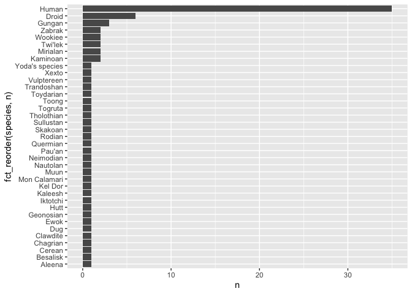
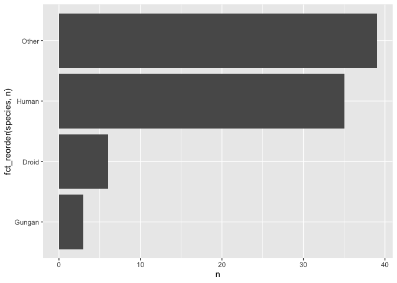

# Lab 08


## Overview

This lab will show you a few functions from `forcats` that we didn’t
have time to cover in the lecture.

## `forcats`

To explore factors, we will use the `starwars` data that comes as part
of the `tidyverse`. You can learn more about the data
[here](https://dplyr.tidyverse.org/reference/starwars.html).

### `fct_lump()`

`fct_lump()` lets you lump together all the small groups in a factor to
make a plot or table simpler.

To demonstrate `fct_lump()`, first take a look at the plot below. Note
my use of `fct_reorder()` within `ggplot()`. Typically, we’ve used
`fct_*` functions in combination with `mutate()`. Here I show that you
can use `fct_*` functions in a `ggplot()` call.

Examining this plot, you’ll notice that several species occur quite
infrequently (e.g., Ewok).

``` r
starwars |>
  count(species) |>
  filter(!is.na(species)) |> 
  ggplot(aes(y = n, x = fct_reorder(species, n))) +
  geom_col() + 
  coord_flip()
```



`fct_lump()` lets you lump together all the small groups into a single
“Other” factor. You can see it in action here.

``` r
starwars |>   
filter(!is.na(species)) |>
  count(species = fct_lump(f = species, n = 3))
```

    # A tibble: 4 × 2
      species     n
      <fct>   <int>
    1 Droid       6
    2 Gungan      3
    3 Human      35
    4 Other      39

Here I use `fct_lump()` to remake the plot above. Notice how
`fct_lump()` has simplified our graph.

``` r
starwars |>   
filter(!is.na(species)) |>
  count(species = fct_lump(f = species, n = 3)) |> 
  ggplot(aes(y = n, x = fct_reorder(species, n))) +
  geom_col() + 
  coord_flip()
```



Try adjusting the `n` argument in the `fct_lump()` function.

Use `fct_relevel()` to move around the Other category on your plot.

## I want to do more!

- Work through the
  [forcats](https://forcats.tidyverse.org/articles/forcats.html)
  vignette.
- Start [Homework 4](hw-04.md).
